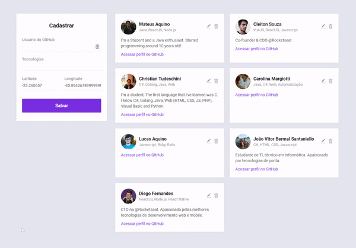

</img>
<h1 align="center">Semana Omnistack 10</h1>
<p align="center">Projeto <strong>DevRadar</strong> desenvolvido durante a Omnistack da Rocketseat</p>

<p align="center">
  <a aria-label="Versão do Node" href="https://github.com/nodejs/node/blob/master/doc/changelogs/CHANGELOG_V12.md#12.14.1">
    </img>
  </a>
  <a aria-label="Versão do React" href="https://github.com/facebook/react/blob/master/CHANGELOG.md#16120-november-14-2019">
    </img>
  </a>
   <a aria-label="Versão do React-native" href="https://www.npmjs.com/package/react-native/v/0.61.5">
    </img>
  </a>
  <a aria-label="Dia 5 de 5" href="https://rocketseat.com.br/week-10/aulas#5">
    </img>
  </a>
</p>

## Instalação
Configure o MongoDB e atualize a string de conexão com seu `User:Senha` no arquivo `index.js`.  
Para instalar as dependências e executar o Servidor (modo desenvolvimento), clone o projeto em seu computador e em seguida execute:
```bash
cd backend
yarn install
yarn dev
```
Para iniciar o Frontend do React utilize o comando:
```bash
cd web
yarn install
yarn start
```
Para iniciar o app mobile com Expo
```bash
cd mobile
yarn install
yarn start
```
Assim que o processo terminar, automaticamente será aberta no seu navegador a página `localhost:3000` contendo o Projeto desenvolvido.

## Backend
Veja em [Backend/README.md](./backend) para informações sobre o Backend e arquitetura.

## Frontend
Veja em [web/README.md](./web) para informações sobre o Frontend e os padrões.

## Mobile
Veja em [mobile/README.md](./mobile) para informações sobre o App Mobile

</img>

## Licença

[MIT](./LICENSE) &copy; [Rocketseat](https://rocketseat.com.br/)
